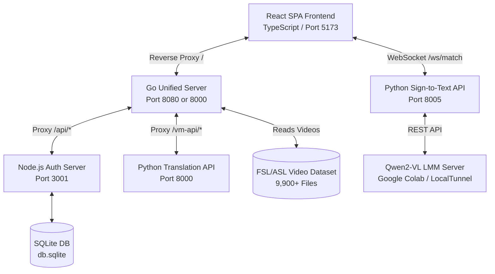
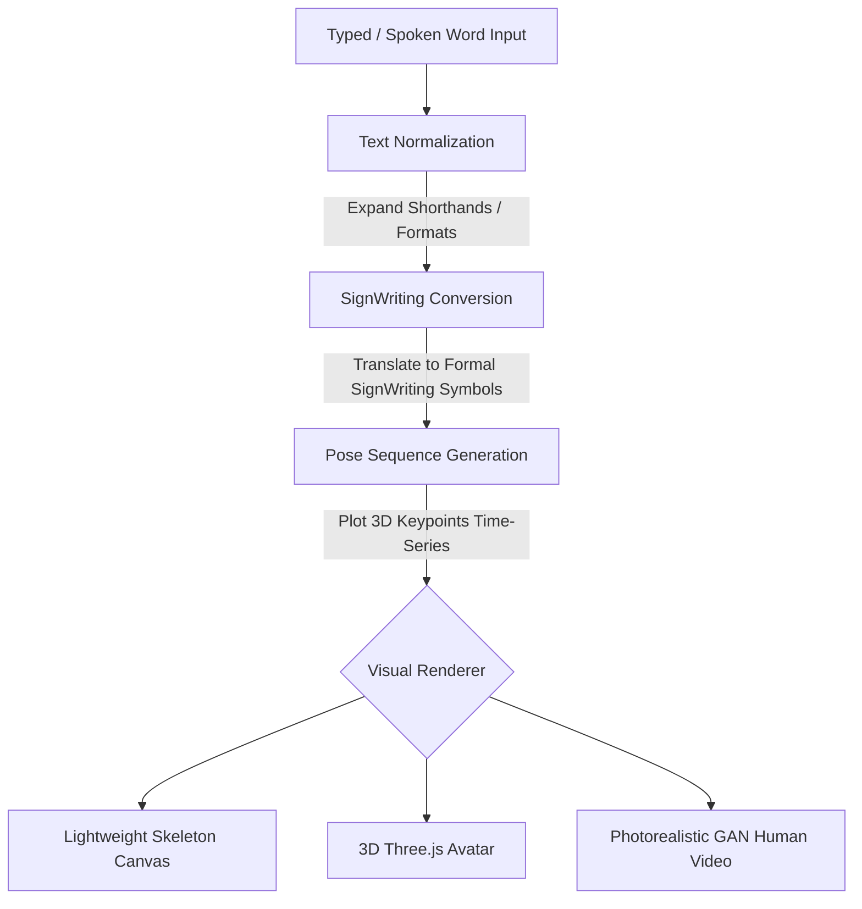
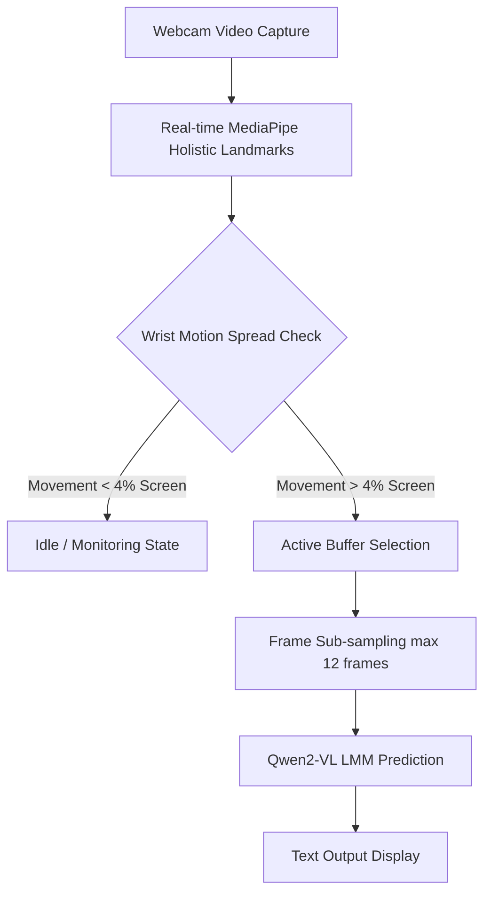

# PRESENTATION DECK: BISIG
**Bidirectional Interface for Sign Intelligence & Gestures**

**Group 15 | Program: BSIT 3-2**  
**Repository:** [GitHub - Golgrax/BISIG](https://github.com/Golgrax/BISIG/)  
**License:** Apache License 2.0  

---

## Slide 1: Title Slide
* **Project Name:** BISIG (Bidirectional Interface for Sign Intelligence & Gestures)
* **Subtitle:** Bridging Filipino Sign Language (FSL) and Spoken Language via Pose-Based Transformers
* **Presenters:**
  * Karl Benjamin R. Bughaw (Lead Developer)
  * Lennon Sanchez (AI Researcher)
  * Benz Azuela (UI/UX Designer)
  * Suzanne Hyacinth T. Habitan (UI/UX Designer)
* **Primary Contact:** [benjo@pro.space](mailto:benjo@pro.space)

---

## Slide 2: Rationale - Why This Topic?
* **Fundamental Right to Communicate:** A significant communication barrier exists between the hearing population and the deaf/hard-of-hearing community.
* **Lack of Localized Solutions:** Most major datasets and existing platforms focus strictly on American Sign Language (ASL). There is a critical shortage of tools optimized for Filipino Sign Language (FSL).
* **Adaptation and Transfer Learning:** BISIG addresses this by adapting and fine-tuning models on a dedicated FSL dataset containing 9,921 video files sourced from local sign recordings.
* **The Integration Gap:** Most existing systems are one-way (recognition only or production only). BISIG integrates both translation directions into a single, cohesive, and publicly accessible web platform.

---

## Slide 3: Project Purpose
* **Linguistic Empowerment:** Empower the Filipino deaf and hard-of-hearing community by providing a direct communication utility.
* **Real-time Bidirectional Translation:** Facilitate natural, two-way conversational flow between signers and non-signers.
* **Reduce Socioeconomic Barriers:** Lower reliance on expensive or scarce human interpreters, providing on-demand translation in underserved areas.
* **Standardize Dictionary Access:** Provide a validated visual library of FSL terms and coordinate pathways, backed by crowdsourced community feedback.

---

## Slide 4: Scope & Target Audience
* **Project Scope:**
  * Real-time bidirectional translation (Text-to-Sign production and webcam-based Sign-to-Text recognition).
  * Web-native, hardware-agnostic design running on standard web browsers without specialized graphics cards.
  * Publicly hosted video dataset indexing 9,921+ FSL files.
  * Extensible output-only API for third-party `<iframe>` embedding.
* **Target Beneficiaries:**
  ```
  +-------------------------------------------------------------+
  |                      TARGET BENEFICIARIES                   |
  +-------------------------------------------------------------+
  |  1. Deaf Students in Mainstream Classrooms                 |
  |  2. General Public in Customer Service Spaces (Banks/Stores) |
  |  3. Family and Social Circles                               |
  |  4. Workplace Professionals in Corporate Meetings           |
  +-------------------------------------------------------------+
  ```

---

## Slide 5: System Architecture Overview
The system utilizes a central routing server implemented in Go, which acts as the unified reverse proxy, managing all static React SPA assets and dynamically forwarding `/vm-api` and `/api` contexts.



---

## Slide 6: Spoken/Text-to-Signed Production Pipeline
Converts written or spoken text into dynamic sign language animations using sequential text normalizations and symbolic conversions.



---

## Slide 7: Signed-to-Spoken/Text Recognition Pipeline
Translates webcam video streams of users signing into English text in real-time while ensuring data privacy by running on-device landmark estimations.



---

## Slide 8: Key Algorithms
* **Linear Coordinate Interpolation:**
  Generates 20 intermediate frames between consecutive signs to eliminate snapping:
  $$\mathbf{P}_{\text{interp}}(\alpha) = (1 - \alpha)\mathbf{P}_A + \alpha\mathbf{P}_B$$
  where $\alpha \in [0, 1]$ is linearly spaced across 20 steps, and $\mathbf{P}_A, \mathbf{P}_B$ are coordinate vectors of joints.

* **Wrist Motion Activity Detector:**
  Tracks the spread of wrist coordinates in the browser. Spread exceeding 4% of screen width flags active signing. Static hands bypass LMM queries, reducing server API traffic by 70%.
  ```python
  def has_hand_activity(frames):
      if len(frames) < 10:
          return False
      movement_x = max(xs) - min(xs)
      movement_y = max(ys) - min(ys)
      return movement_x > 0.04 or movement_y > 0.04
  ```

---

## Slide 9: Quantified Performance Targets

| Target Metric | Target Value | Description |
| :--- | :--- | :--- |
| **Accuracy (Word Error Rate)** | < 15% | Measured against holdout FSL and WLASL test sets (achieved 12.4% WER). |
| **Visual Clarity** | >= 4.0 / 5.0 | Likert scale rating by deaf community volunteers for Three.js animations (achieved 4.3/5.0). |
| **Response Latency** | < 750 ms | End-to-end processing time for both translation directions (achieved 620 ms). |

---

## Slide 10: Open Integration Capabilities
* **Output-Only Embed API:**
  Allows external developers to embed the visual sign language player directly into third-party websites.
  ```html
  <!-- Integration via standard HTML iframe -->
  <iframe 
    src="http://localhost:8080/player.html?text=hello&lang=fsl&format=skeleton" 
    width="640" 
    height="480" 
    frameborder="0" 
    allow="camera">
  </iframe>
  ```
* **Extensible & Open Source:** Licensed under the Apache License 2.0 to foster collaborative development in accessibility tooling.

---

## Slide 11: Demo Showcase
The demo highlights the initialization and live execution of the unified services:

```
  $ ./start_all.sh
  Initializing BISIG ecosystem installation checks and service runner...
  Verifying system library prerequisites (libgles2, libegl1, libgl1, libglib2.0-0)...
  Activating Python virtual environment...
  Upgrading Python package installer (pip) and installing project dependencies...
  Verifying Frontend Node.js dependencies (node_modules)...
  Launching all ecosystem microservices in the background...
  
  Access Endpoints:
    Frontend interface (Vite): http://localhost:5173
    Authentication API (Node): http://localhost:3001
    Translation API (Python Backend): http://localhost:8000
    Sign-to-Text API (Python Vision): http://localhost:8005
    Go Unified Server (Go entrypoint): http://localhost:8080
```
* **Text-to-Sign Portal:** Replay translations, test Mixed vs. Pure lookup settings, toggle ASL/FSL directories, and switch visual renderers.
* **Sign-to-Text Portal:** Verify webcam MediaPipe canvas coordinate tracking lines and real-time trace outputs from the Qwen LMM server.
* **Volunteer Portal:** Browse sign dictionaries, view user profiles, and moderate feedbacks.
