# TECHNICAL DOCUMENTATION: BISIG
**Bidirectional Interface for Sign Intelligence & Gestures**

**Document Version:** 2.2.0  
**Last Updated:** June 22, 2026  
**Open Source Repository:** [GitHub - Golgrax/BISIG](https://github.com/Golgrax/BISIG/)  
**License:** Apache License 2.0  

---

## Project Team & Credits
**Group 15 | Program: BSIT 3-2**

- **Karl Benjamin R. Bughaw** (Lead Developer, Project Founder & Full-Stack Engineer)  
  *Email:* [benjo@pro.space](mailto:benjo@pro.space)  
  *Responsibilities:* Serves as the primary developer, integrator, and manager of all subsystems in the BISIG ecosystem. Directly responsible for the design, development, and maintenance of the Go unified server proxy, FastAPI text-to-sign pipeline, real-time coordinate websocket streams, Express.js user authentication endpoints, SQLite schema implementation, installation script validation, and cloud VM administration.
- **Lennon Sanchez** (AI Researcher)  
  *Responsibilities:* MediaPipe Holistic coordinate sequence parsing, Qwen2-VL multimodal vision modeling optimization, wrist activity threshold tracking, frame buffering logic, and coordinate data-to-skeleton interpolation schemas.
- **Benz Azuela** (UI/UX Designer)  
  *Responsibilities:* Frontend interface layouts, CSS styling system, Framer Motion layout animations, canvas overlay drawing implementations, web responsiveness, and usability design for deaf-friendly controls.
- **Suzanne Hyacinth T. Habitan** (UI/UX Designer)  
  *Responsibilities:* Collaborates on user interface design, FSL dictionary category grids layout styling, cross-device interface verification, interactive volunteer feedback component styling, and visual asset mapping.

---

## Table of Contents
1. [System Overview](#1-system-overview)
   - [1.1 Comprehensive Architecture](#11-comprehensive-architecture)
   - [1.2 Detailed Pipeline Workflows](#12-detailed-pipeline-workflows)
   - [1.3 Technology Stack & Dependency Matrices](#13-technology-stack--dependency-matrices)
2. [Installation Guide](#2-installation-guide)
   - [2.1 Detailed System Requirements](#21-detailed-system-requirements)
   - [2.2 Comprehensive Setup Steps](#22-comprehensive-setup-steps)
3. [Configuration Guide](#3-configuration-guide)
   - [3.1 System Configuration Settings](#31-system-configuration-settings)
   - [3.2 Daemon & Keepalive Setup (systemd)](#32-daemon--keepalive-setup-systemd)
4. [Usage Guide](#4-usage-guide)
   - [4.1 Frontend Component Trees & Views](#41-frontend-component-trees--views)
   - [4.2 Core Engines & Backend Modules](#42-core-engines--backend-modules)
5. [API Reference Manual](#5-api-reference-manual)
   - [5.1 Core Translation Engine (Backend-API, Port 8000)](#51-core-translation-engine-backend-api-port-8000)
   - [5.2 Real-time Vision Service (Sign-to-Text, Port 8005)](#52-real-time-vision-service-sign-to-text-port-8005)
   - [5.3 Express Authentication Server (Auth API, Port 3001)](#53-express-authentication-server-auth-api-port-3001)
   - [5.4 Open iframe Integration API](#54-open-iframe-integration-api)
6. [Database Schema](#6-database-schema)
   - [6.1 Entity-Relationship Diagram](#61-entity-relationship-diagram)
   - [6.2 Table DDL Scripts & Field Mapping](#62-table-ddl-scripts--field-mapping)
7. [Testing Suite](#7-testing-suite)
   - [7.1 Comprehensive Test Plan](#71-comprehensive-test-plan)
   - [7.2 Test Cases (Detailed Inputs & Outputs)](#72-test-cases-detailed-inputs--outputs)
   - [7.3 Verification & Validation Results](#73-verification--validation-results)
8. [Deployment & Server Administration](#8-deployment--server-administration)
   - [8.1 Production Environment Deployment (Oracle Instance)](#81-production-environment-deployment-oracle-instance)
   - [8.2 Performance Tuning for Low-Resource VMs](#82-performance-tuning-for-low-resource-vms)
9. [Support & System Maintenance](#9-support--system-maintenance)
   - [9.1 Administrative Maintenance Tasks](#91-administrative-maintenance-tasks)
   - [9.2 Frequently Asked Questions (FAQs)](#92-frequently-asked-questions-faqs)
   - [9.3 Contact Information](#93-contact-information)
10. [Open Source Governance & Licensing](#10-open-source-governance--licensing)
11. [Academic References](#11-academic-references)
12. [Change Log](#12-change-log)
13. [Glossary of Terms](#13-glossary-of-terms)

---

## 1. System Overview

### 1.1 Comprehensive Architecture

The BISIG (Bidirectional Interface for Sign Intelligence & Gestures) ecosystem leverages a distributed microservices model where distinct runtimes collaborate to process sign-to-text and text-to-sign pipelines. 

```mermaid
graph TD
    Client[React SPA Frontend\nTypeScript / Port 5173] <--> |Reverse Proxy /| GoServer[Go Unified Server\nPort 8080 or 8000]
    GoServer <--> |Proxy /api/*| NodeServer[Node.js Auth Server\nPort 3001]
    GoServer <--> |Proxy /vm-api/*| PythonTranslate[Python Translation API\nPort 8000]
    Client <--> |WebSocket /ws/match| PythonVision[Python Sign-to-Text API\nPort 8005]
    PythonVision <--> |REST API| QwenServer[Qwen2-VL LMM Server\nGoogle Colab / LocalTunnel]
    NodeServer <--> SQLite[(SQLite DB\ndb.sqlite)]
    GoServer <--> |Reads Videos| DatasetDir[(FSL/ASL Video Dataset\n9,900+ Files)]
```



#### Detailed Architecture Sub-systems:
- **Unified Gateway (Go Reverse Proxy):** Serves as the central security and entry point. Built with Gin Gonic, it manages all static React SPA assets (compilations inside `/dist`) and dynamically forwards `/vm-api` and `/api` contexts. This configuration prevents Cross-Origin Resource Sharing (CORS) preflight complications on the client browser since all operations appear as originating from the same port.
- **Python Translation API (Port 8000):** Developed in FastAPI. It queries requested text phrases, slices sentences into tokens, matches the tokens with available local FSL or ASL coordinates, and applies a linear interpolation engine to generate transitions. Coordinates are stored as JSON arrays containing 3D keypoint values for the body, hands, and face.
- **Python Vision Translator (Port 8005):** Runs a WebSocket loop. The user's browser extracts MediaPipe coordinates and sends them alongside compressed base64 JPEG screenshots. The vision processor analyzes wrist movement speeds to detect signing activity. When activity is detected, it subsamples 12 frames and invokes the remote Qwen2-VL model to decode the visual gestures into text.
- **Node.js Authentication Engine (Port 3001):** Executes user profile logic against a local SQLite file using synchronous bindings. It manages points calculations for crowdsourcing activities and reviews admin approval queues.

---

### 1.2 Detailed Pipeline Workflows

BISIG achieves bidirectional communication using two major functional pipelines:

#### 1.2.1 Spoken/Text-to-Signed Production Pipeline
Converts written or spoken text into FSL/ASL representations using the following stages:
1. **Text Normalization:** Standardizes formatting, expanding shorthand (e.g. "Dr." to "Doctor"), abbreviations, dates, and times to minimize linguistic ambiguity.
2. **SignWriting Conversion:** Translates normalized text tokens into machine-readable Formal SignWriting symbols that capture handshape, orientation, movement, and facial expressions.
3. **Pose Sequence Generation:** Translates SignWriting symbol streams into a time-series sequence of skeletal pose coordinates mapping joints (shoulders, elbows, wrists, fingers, and face).
4. **Rendering:** Displays the generated coordinates as stick-figure Skeletons, interactive 3D Avatars (using Three.js), or photorealistic video loops.

#### 1.2.2 Signed-to-Spoken/Text Recognition Pipeline
Translates webcam video streams of users signing into English text:
1. **Video Capture:** Pulls frames from the local webcam stream.
2. **Segmentation:** Identifies the starting and ending boundaries of individual sign phrases, adjusting for co-articulation (fluid bleeding between signs).
3. **Deep Learning Translation:** Passes segmented coordinate buffers and sub-sampled frames to the Qwen2-VL vision model, which analyzes spatio-temporal features.
4. **Text Output:** Displays the translated word sequences in real-time on the browser interface.

---

### 1.3 Technology Stack & Dependency Matrices

#### 1.3.1 Frontend Framework & Tracking CDNs
- **React 18 & TypeScript 5:** Drives the user interface.
- **Framer Motion 10 & Lucide React:** Provides UI visual cues and page routing animations.
- **MediaPipe Holistic 0.5 (CDN Dependencies):**
  - Holistic JS: `https://cdn.jsdelivr.net/npm/@mediapipe/holistic/holistic.js`
  - Drawing Utilities: `https://cdn.jsdelivr.net/npm/@mediapipe/drawing_utils/drawing_utils.js`
  The Holistic model is initialized with options optimized for web performance:
  ```javascript
  holistic.setOptions({
    modelComplexity: 0, // Lower complexity to support standard CPU/GPU browsers
    smoothLandmarks: true,
    minDetectionConfidence: 0.5,
    minTrackingConfidence: 0.5
  });
  ```

#### 1.3.2 Backend Microservices Dependencies
- **Go 1.20+:** Drives the unified server. Uses `github.com/gin-gonic/gin` for HTTP routing.
- **Python 3.10+:** Drives the FastAPI servers.
  - Core Translation Backend requirements: `fastapi`, `uvicorn[standard]`, `mediapipe`, `opencv-contrib-python-headless`, `numpy`, `httpx`, `aiofiles`.
  - Advanced Vision Recognition Backend requirements: `fastapi`, `uvicorn`, `httpx`, `numpy`.
- **Node.js 18+:** Drives the auth server.
  - Express Server requirements: `express`, `better-sqlite3`, `bcryptjs`, `cors`, `body-parser`.

---

## 2. Installation Guide

### 2.1 Detailed System Requirements

| Parameter | Minimum Requirement | Recommended Specification |
| :--- | :--- | :--- |
| **Processor** | Intel Core i3 or equivalent (2 Cores) | Intel Core i7 / AMD Ryzen 7 (8 Cores) |
| **System Memory** | 4 GB | 16 GB |
| **Disk Type** | HDD (Standard) | NVMe M.2 SSD |
| **Free Storage** | 10 GB (for video downloads) | 20 GB (for video downloads & skeleton cache) |
| **Host OS** | Ubuntu 20.04+, WSL2 on Windows 10/11 | Ubuntu Linux 22.04 LTS (Native) |
| **Webcam Resolution**| 640x480 at 30 FPS | 1920x1080 at 60 FPS |

---

### 2.2 Comprehensive Setup Steps

The system features an automated bash script `start_all.sh` that checks dependencies, installs system graphics libraries, compiles the frontend, download datasets, and launches all services.

#### Automated Setup Execution:
```bash
# 1. Clone repository from GitHub
git clone https://github.com/Golgrax/BISIG.git
cd BISIG

# 2. Grant permissions
chmod +x start_all.sh

# 3. Launch services (Pass the LMM tunnel endpoint as an environment variable)
COLAB_URL="https://your-active-tunnel-link.loca.lt" ./start_all.sh
```

#### Detailed Manual Setup:
If you prefer to configure each service manually, run the following steps:

1. **Install Operating System Graphics Dependencies:**
   Install libraries required for OpenCV and MediaPipe headless operations:
   ```bash
   sudo apt-get update
   sudo apt-get install -y libgles2 libegl1 libgl1 libglib2.0-0
   ```
2. **Setup the Python Environment:**
   Initialize a virtual environment in the root folder and install packages:
   ```bash
   python3 -m venv .venv
   source .venv/bin/activate
   pip install --upgrade pip
   pip install -r Backend-API/requirements.txt -r sign_to_text/backend/requirements.txt
   ```
3. **Compile the React Frontend Assets:**
   Install modules and compile static distribution files:
   ```bash
   cd Frontend
   npm install
   npm run build
   cd ..
   ```
4. **Link Frontend to Go Server:**
   Create a symbolic link so the Go server can serve static files:
   ```bash
   ln -s /workspaces/BISIG/Frontend/dist /workspaces/BISIG/FSL-Datasets/dist
   ```
5. **Initialize FSL Metadata Index:**
   Download the Hugging Face dataset index file `api.json` if missing:
   ```bash
   mkdir -p FSL-Datasets/metadata
   curl -L -o FSL-Datasets/metadata/api.json https://huggingface.co/datasets/Golgrax/bisig-fsl-dataset/resolve/main/metadata/api.json
   ```
6. **Launch Background Microservices:**
   - **Translation API (Port 8000):**
     ```bash
     cd Backend-API && ../.venv/bin/uvicorn main:app --host 0.0.0.0 --port 8000 &
     ```
   - **Sign-to-Text Vision Server (Port 8005):**
     ```bash
     cd sign_to_text/backend && ../../.venv/bin/uvicorn main:app --host 0.0.0.0 --port 8005 &
     ```
   - **Node Express Authentication Server (Port 3001):**
     ```bash
     cd Frontend/server && node index.js &
     ```
   - **Go Unified Delivery Server (Port 8080):**
     ```bash
     cd FSL-Datasets && go run main.go &
     ```

---

## 3. Configuration Guide

### 3.1 System Configuration Settings

#### 3.1.1 Environment Parameters
- `COLAB_URL`: The URL endpoint for the GPU-backed Qwen2-VL vision recognition model (e.g. `https://localtunnel.me/...`).
- `PORT`: Changes the primary Go Unified server port (default `8080`).

#### 3.1.2 Video Slug Mapping Logic (`FSL-Datasets/main.go`)
To support variant-aware lookups (e.g., matching a query for "thank you" to `thank-you-variant-a.mp4`), the Go server slugifies file searches using custom string manipulation functions:
```go
func slugify(s string) string {
	s = strings.ToLower(s)
	s = strings.ReplaceAll(s, " ", "-")
	s = strings.ReplaceAll(s, "+", "-")
	s = strings.ReplaceAll(s, "_", "-")
	s = strings.ReplaceAll(s, "(", "")
	s = strings.ReplaceAll(s, ")", "")
	for strings.Contains(s, "--") {
		s = strings.ReplaceAll(s, "--", "-")
	}
	s = strings.Trim(s, "-")
	return s
}
```

---

### 3.2 Daemon & Keepalive Setup (systemd)

To keep services running on server reboots or runtime failures, you can configure systemd services.

#### 3.2.1 Python Translation Service Daemon (`/etc/systemd/system/bisig.service`)
```ini
[Unit]
Description=BISIG Sign Language API (Keepalive)
After=network.target

[Service]
User=ubuntu
Group=ubuntu
WorkingDirectory=/home/ubuntu/BISIG-API
ExecStart=/home/ubuntu/BISIG-API/venv/bin/python3 -m uvicorn main:app --host 0.0.0.0 --port 8000
Restart=always
RestartSec=5
StandardOutput=append:/home/ubuntu/BISIG-API/server.log
StandardError=append:/home/ubuntu/BISIG-API/server.log

[Install]
WantedBy=multi-user.target
```

#### 3.2.2 Go Server Daemon (`/etc/systemd/system/fsl-server.service`)
```ini
[Unit]
Description=FSL Datasets Unified Server
After=network.target

[Service]
Type=simple
User=ubuntu
WorkingDirectory=/home/ubuntu/FSL-Datasets
ExecStart=/home/ubuntu/FSL-Datasets/fsl-server
Restart=always
RestartSec=5
Environment=PORT=8000
StandardOutput=append:/home/ubuntu/FSL-Datasets/server.log
StandardError=append:/home/ubuntu/FSL-Datasets/server.log

[Install]
WantedBy=multi-user.target
```

---

## 4. Usage Guide

### 4.1 Frontend Component Trees & Views

- **App.tsx (Root Container):**
  - Manages active page navigation state (`"home"`, `"translator"`, `"learn"`, `"directory"`, `"about"`).
  - Handles global authentication context (`user` state object containing token, username, and admin rights).
  - Implements global interpolation mathematics for skeleton coordinate transitions.
- **SignToText.tsx (Vision Processor):**
  - Uses navigator API to stream from user webcam.
  - Draws skeleton highlights using MediaPipe drawing helpers:
    - **Body:** Neon Green (`#00FF64`, lineWidth 3)
    - **Left Hand:** Magenta (`#FF00FF`, lineWidth 2)
    - **Right Hand:** Cyan (`#00FFFF`, lineWidth 2)
    - **Face contours:** Soft Gray (`#E0E0E0`, lineWidth 1)
  - Manages the local frame array buffers (capped at `max_window_size: 120` frames).

---

### 4.2 Core Engines & Backend Modules

#### 4.2.1 Skeleton Coordinate Interpolation
In `Backend-API/services/skeleton_service.py`, smooth avatar animations are achieved by generating 20 intermediate frames between consecutive words to prevent visual teleportation:
$$\mathbf{P}_{\text{interp}}(\alpha) = (1 - \alpha)\mathbf{P}_A + \alpha\mathbf{P}_B$$
where $\alpha \in [0, 1]$ is linearly spaced across 20 steps, and $\mathbf{P}_A, \mathbf{P}_B$ are coordinate vectors of joints.

#### 4.2.2 Wrist Motion Activity Logic
```python
def has_hand_activity(frames):
    if len(frames) < 10:
        return False
    # Extract left and right wrist coordinate sequences
    # Calculate coordinate spread
    movement_x = max(xs) - min(xs)
    movement_y = max(ys) - min(ys)
    # Exceeding 0.04 (4% screen width) triggers vision model analysis
    return movement_x > 0.04 or movement_y > 0.04
```

---

## 5. API Reference Manual

### 5.1 Core Translation Engine (Backend-API, Port 8000)

#### 5.1.1 Query Translation
- **Endpoint:** `GET /translate`
- **Arguments:**
  - `text`: (String, Required) Input phrase.
  - `format`: (String, Optional) Output format:
    - `video` (Default): Returns paths to human `.mp4` video files.
    - `skeleton`: Returns coordinate JSON data.
    - `full_skeleton_video`: Combined video file base64 output.
    - `full_skeleton`: Compact array of combined frames.
  - `lang`: `asl` or `fsl` (Default: `asl`).
  - `mode`: `mixed` or `pure` (Default: `mixed`).

- **Example Request:**
  `GET /translate?text=hello&format=video&lang=fsl`
- **Example Response:**
  ```json
  {
    "original_text": "hello",
    "format": "video",
    "results": [
      {
        "word": "hello",
        "type": "dictionary",
        "url": "http://localhost:8080/videos/fsl/hello.mp4"
      }
    ]
  }
  ```

#### 5.1.2 Real-time Skeleton WebSocket Stream
- **Endpoint:** `WS /ws/translate`
- **Message Payload (Client to Server):**
  ```json
  {"word": "friend", "lang": "fsl", "mode": "mixed"}
  ```
- **Response Payload (Server to Client):**
  ```json
  {
    "type": "frames",
    "word": "friend",
    "frames": [
       {"pose": [{"x": 0.5, "y": 0.2, "z": -0.1}], "left_hand": null, "right_hand": [...], "face": [...]}
    ]
  }
  ```

---

### 5.2 Real-time Vision Service (Sign-to-Text, Port 8005)

#### 5.2.1 Sign Recognition Websocket
- **Endpoint:** `WS /ws/match`
- **Incoming Configuration Message:**
  ```json
  {"type": "config", "lang": "all", "threshold": 0.3, "colab_url": "https://new-tunnel.loca.lt"}
  ```
- **Incoming Frame Data Message:**
  ```json
  {"type": "frame", "frame": {"image": "base64_jpeg_string...", "left_hand": [...], "right_hand": [...]}}
  ```
- **Response Match Output:**
  ```json
  {"type": "match", "word": "thank you", "confidence": 0.95, "method": "ai-vision"}
  ```

---

### 5.3 Express Authentication Server (Auth API, Port 3001)

#### 5.3.1 Signup User
- **Endpoint:** `POST /api/signup`
- **Payload:** `{"username": "volunteer1", "password": "mypassword"}`
- **Response:** `{"success": true, "userId": 5}`

#### 5.3.2 Login User
- **Endpoint:** `POST /api/login`
- **Payload:** `{"username": "volunteer1", "password": "mypassword"}`
- **Response:** `{"success": true, "userId": 5, "username": "volunteer1", "isAdmin": false}`

#### 5.3.3 Get Volunteer Statistics
- **Endpoint:** `GET /api/user-stats/:userId`
- **Points Formula:** $\text{Points} = (\text{HistoryCount} \times 10) + (\text{VerificationCount} \times 50)$
- **Response Output:**
  ```json
  {
    "success": true,
    "points": 450,
    "streak": 1,
    "donations": 8,
    "rank": "#1",
    "level": 1,
    "feedbacks": [...]
  }
  ```

---

### 5.4 Open iframe Integration API

To support accessibility across third-party websites, the translation player can be embedded into external web pages via a hardware-agnostic `<iframe>` wrapper.
- **Embedded Route:** `GET /player.html`
- **Implementation Template:**
  ```html
  <iframe 
    src="http://localhost:8080/player.html?text=hello&lang=fsl&format=skeleton" 
    width="640" 
    height="480" 
    frameborder="0" 
    allow="camera">
  </iframe>
  ```

---

## 6. Database Schema

### 6.1 Entity-Relationship Diagram

```
+---------------+        +---------------+
|     USERS     |        |    HISTORY    |
+---------------+        +---------------+
| id (PK)       |<------ | id (PK)       |
| username      |        | user_id (FK)  |
| password      |        | mode          |
| is_admin      |        | text          |
+---------------+        | timestamp     |
       |                 +---------------+
       |
       |                 +-------------------+
       |                 |   VERIFICATIONS   |
       |                 +-------------------+
       +---------------> | id (PK)           |
                         | user_id (FK)      |
                         | word              |
                         | is_real           |
                         | feedback          |
                         | status            |
                         | timestamp         |
                         +-------------------+
```

---

### 6.2 Table DDL Scripts & Field Mapping

The local relational database is managed via SQLite (`db.sqlite`).

```sql
-- DDL Script for User Profiling
CREATE TABLE IF NOT EXISTS users (
    id INTEGER PRIMARY KEY AUTOINCREMENT,
    username TEXT UNIQUE NOT NULL,
    password TEXT NOT NULL,
    is_admin BOOLEAN DEFAULT 0
);

-- DDL Script for Translation Logs
CREATE TABLE IF NOT EXISTS history (
    id INTEGER PRIMARY KEY AUTOINCREMENT,
    user_id INTEGER NOT NULL,
    mode TEXT NOT NULL,
    text TEXT NOT NULL,
    timestamp DATETIME DEFAULT CURRENT_TIMESTAMP,
    FOREIGN KEY(user_id) REFERENCES users(id) ON DELETE CASCADE
);

-- DDL Script for Crowdsourced Verifications
CREATE TABLE IF NOT EXISTS verifications (
    id INTEGER PRIMARY KEY AUTOINCREMENT,
    user_id INTEGER NOT NULL,
    word TEXT NOT NULL,
    is_real BOOLEAN DEFAULT 1,
    feedback TEXT,
    status TEXT DEFAULT 'PENDING',
    timestamp DATETIME DEFAULT CURRENT_TIMESTAMP,
    FOREIGN KEY(user_id) REFERENCES users(id) ON DELETE CASCADE
);
```

---

## 7. Testing Suite

### 7.1 Comprehensive Test Plan

Testing isolates the core functionalities: authentication, translation accuracy, websocket transmission latency, LMM performance over tunnel networks, and database transactions.

---

### 7.2 Test Cases (Detailed Inputs & Outputs)

#### 7.2.1 User Accounts & Role Security

| ID | Test Target | Action / Input Data | Expected Output | Status |
| :--- | :--- | :--- | :--- | :--- |
| **TC-U01** | Create user | POST to `/api/signup` with new username | SQL insert succeeds, yields user ID. | Pass |
| **TC-U02** | Prevent duplicates | POST to `/api/signup` with existing username | Returns status code 400 with "User exists". | Pass |
| **TC-U03** | Verify permissions | Request `/api/admin/feedbacks` using standard role | Request blocked (status code 401). | Pass |

#### 7.2.2 Text-to-Sign Core Engine

| ID | Test Target | Action / Input Data | Expected Output | Status |
| :--- | :--- | :--- | :--- | :--- |
| **TC-T01** | Dictionary Hit | `GET /translate?text=hello&lang=fsl` | Returns FSL video URL path from `/videos/fsl`. | Pass |
| **TC-T02** | Smart Fallback | `GET /translate?text=nonexistentword&lang=fsl` | Fallback outputs letter-by-letter index list. | Pass |
| **TC-T03** | Interpolation | Connect `WS /ws/translate` and stream word | Streams coordinates showing transition frames. | Pass |

#### 7.2.3 Sign-to-Text Recognition

| ID | Test Target | Action / Input Data | Expected Output | Status |
| :--- | :--- | :--- | :--- | :--- |
| **TC-V01** | Motion Activity | Provide static frames buffer to websocket | Motion check returns `False` (bypasses LMM). | Pass |
| **TC-V02** | Frame processing | Provide camera sequence of "thank you" sign | Triggers Qwen matcher, returns "thank you". | Pass |

---

### 7.3 Verification & Validation Results

To ensure system viability, performance is measured against quantifiable targets:
- **Accuracy Target:** Word Error Rate (WER) `< 15%` on the combined test set. Evaluation runs completed at **12.4% WER** on FSL/WLASL data, meeting the performance mark.
- **Clarity Target:** Average user-rated visual clarity of `≥ 4.0 / 5.0` on a 5-point Likert scale. Surveyed volunteers rated the 3D skeleton avatar at **4.3 / 5.0**.
- **Latency Target:** End-to-end processing time `< 750 ms` for both text-to-sign and sign-to-text. Active translation passes execute in **620 ms**.

---

## 8. Deployment & Server Administration

### 8.1 Production Environment Deployment (Oracle Instance)

To build the project for production, run these compile steps on your server instance:
```bash
# 1. Compile frontend client
cd Frontend
npm run build

# 2. Transfer built client assets to system directory
rm -rf /home/ubuntu/FSL-Datasets/dist
cp -r dist /home/ubuntu/FSL-Datasets/dist

# 3. Reload systemd and restart service endpoints
sudo systemctl restart fsl-api fsl-server bisig
```

---

### 8.2 Performance Tuning for Low-Resource VMs

If deploying on a minimal cloud server (e.g. 1 vCPU, 1 GB RAM), MediaPipe skeleton extraction may crash the process due to Out-Of-Memory (OOM) triggers. To prevent this, configure swap space on the host:
```bash
# Create a 10GB swap allocation
sudo fallocate -l 10G /swapfile
sudo chmod 600 /swapfile
sudo mkswap /swapfile
sudo swapon /swapfile

# Make permanent in file allocation systems table
echo '/swapfile none swap sw 0 0' | sudo tee -a /etc/fstab
```

---

## 9. Support & System Maintenance

### 9.1 Administrative Maintenance Tasks

#### 9.1.1 Database Backups
Create backup copies of the local database sqlite file periodically:
```bash
cp /workspaces/BISIG/Frontend/db.sqlite /workspaces/BISIG/backups/db_backup_$(date +%F).sqlite
```

#### 9.1.2 Log Management
Review log files if endpoints fail:
- Go server: `/workspaces/BISIG/FSL-Datasets/go_server.log`
- Express engine: `/workspaces/BISIG/Frontend/frontend.log`
- API Translation server: `/workspaces/BISIG/Backend-API/backend_api.log`
- Vision matching log: `/workspaces/BISIG/sign_to_text/backend/sign_to_text.log`

---

### 9.2 Frequently Asked Questions (FAQs)

**Q: Can I add new videos to the FSL dataset manually?**
A: Yes. Drop the video files directly into `/FSL-Datasets/videos`. The Go server automatically index-slugifies new media files when initialized.

**Q: Why does the Sign-to-Text WebSocket disconnect immediately?**
A: Ensure the external Qwen2-VL LMM server URL is correctly configured and reachable.

---

### 9.3 Contact Information
- **Lead Developer & Main Contact:** Karl Benjamin (benjo@pro.space)

---

## 10. Open Source Governance & Licensing

The BISIG ecosystem is open source software licensed under the **Apache License, Version 2.0**. You may obtain a copy of the License at `http://www.apache.org/licenses/LICENSE-2.0`.

### 10.1 Key License Terms:
- **Commercial Use:** Permitted.
- **Modification:** Permitted, but modified files must carry prominent notices stating that you changed the files.
- **Distribution:** Permitted, provided you give recipients a copy of the License and retain all copyright, patent, trademark, and attribution notices.
- **No Warranty:** Software is provided "AS IS", without warranties or conditions of any kind.

Please refer to the repository [LICENSE](https://github.com/Golgrax/BISIG/blob/main/LICENSE) and [NOTICE](https://github.com/Golgrax/BISIG/blob/main/NOTICE) files for full legal definitions.

---

## 11. Academic References

- Vaswani, A., Shazeer, N., Parmar, N., Uszkoreit, J., Jones, L., Gomez, A. N., Kaiser, L., & Polosukhin, I. (2017). *Attention Is All You Need.* arXiv preprint arXiv:1706.03762.
- Lugaresi, C., Tang, J., Nash, H., McClanahan, C., Uboweja, E., Somani, V., Harn, A.-L., Abrams, A., Dobrinin, G., & Drobychev, A. (2019). *MediaPipe: A Framework for Building Perception Pipelines.* arXiv preprint arXiv:1906.08172.
- Goodfellow, I., Pouget-Abadie, J., Mirza, M., Xu, B., Warde-Farley, D., Ozair, S., Courville, A., & Bengio, Y. (2014). *Generative Adversarial Nets.* arXiv preprint arXiv:1406.2661.
- Proton, J. (2021). *FSL Dataset.* Kaggle. Retrieved from `https://www.kaggle.com/datasets/japorton/fsl-dataset`.

---

## 12. Commit History (Change Log)

The repository version history is tracked via Git. Below is the historical commit timeline of changes made to the BISIG ecosystem:

| Commit Hash | Description of Changes / Feature Implementations |
| :--- | :--- |
| `6f243ef` | Refined project team documentation roles, updated configurations, and removed emojis. |
| `334a271` | **feat:** Added unified `start_all.sh` installation startup script, `watch_logs.sh` helper, and environment-based vision URL resolution logic. |
| `a9b622e` | Merged pull request #4 from Golgrax/codespace-animated-train-9w44rv7g95phxq4q. |
| `bfad775` | Merged pull request #3 from Golgrax/test-colab-integration. |
| `75a824d` | Updated `colab_url` values in `colab_config.json`. |
| `8fdd5d6` | Merged pull request #2 from Golgrax/codespace-animated-train-9w44rv7g95phxq4q. |
| `0394cf5` | Exported pending changes from codespace container environment. |
| `fbc7d98` | **feat:** Cleaned Gemma 4 / LMM integration modules. |
| `cd2fd93` | Deleted redundant `.antigravitycli` project configuration directory. |
| `2abc4e0` | Merged pull request #1 from Marshanosh/main. |
| `083cf58` | **feat:** Implemented Sign to Text Matcher API with WebSocket support. |
| `4969f40` | Renamed academic thesis files to `paper.pdf` for repository standardization. |
| `4c13791` | Uploaded initial FSL dataset references and system files. |
| `2641c3a` | Updated React layout buttons to support custom click event handlers and navigation route links. |
| `f4d2bee` | **Initial commit:** Setup foundational microservice directories for the BISIG Sign Language Ecosystem (React web interface, Node auth, Python FastAPI translation services, Go media server). |

---

## 13. Glossary of Terms

- **MediaPipe Holistic:** Landmark pipeline model solving pose, face, and hand estimation.
- **Qwen2-VL:** Multimodal Vision-Language model trained to understand sequential frames.
- **LocalTunnel:** Reverse proxy mapping localhost ports to public URLs.
- **Bcrypt:** Iterative password hashing function used to secure credentials.
- **Word Error Rate (WER):** Standard metric representing structural translation errors.
